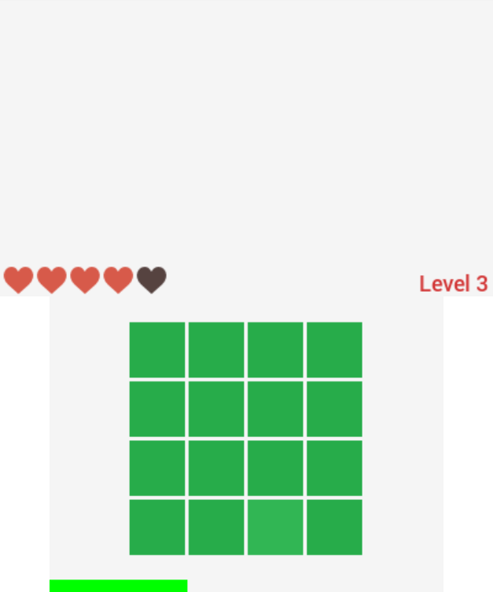

# Pickr

After viewing one of the latest DONG's by Vsauce guys, I decided to port [Sean M. Tracey](https://twitter.com/seanmtracey) [**Pickr**](https://smt.codes/stuff/pickr/) game to the 3DS, and later to Switch.

This completely is a **just for fun** project; I actually decided to challenge myself to complete it within a couple hours maximum.

## Todo

* Lots of stuff. Maybe savedata? Global leaderboard?
* Rewrite the 3DS version code 'cause it's a big mess.

## Screenshots

## Credits

* Sean M. Tracey, for the idea
* nx-hbmenu contributors for the Switch graphic functions